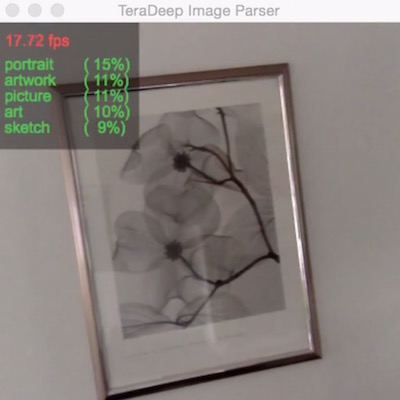

# demonstration application - Embedded

This is our May 2015 top neural network for large-scale object recognition. It has been trained to recognize most typical home indoor/outdoor objects in our daily life. It was trained with more that 10 M images on a private dataset. It can serve as good pair of eyes for your machines, robots, drones and all your wonderful creations!

<!--[]-->

See it in action in this [video #1](https://www.youtube.com/watch?v=_wXHR-lad-Q), and also this other [video #2](https://www.youtube.com/watch?v=B0TreumQO-0).

This application is for tinkerers, hobbiest, researchers, evaluation purpose, non-commercial use only.

This library is exclusive for embedded linux and linux machines. For a full PC Torch7 implementation of this same demonstration, see `generic-pc` in this repository. 

It has been tested on ODROID XU4 and Tegra TX1 boards. It can run at > 1 fps on the ODROID XU4, and a lot faster on the Tegra GPU.

## install:
Requirements: libfreetype6-dev, OpenCV.

Install our embedded library thnets: https://github.com/mvitez/thnets

### On ARM:

	git clone https://github.com/mvitez/thnets.git
	cd thnets
	export LD_LIBRARY_PATH=/usr/local/lib
	cd OpenBLAS-stripped
	make
	sudo make install
	cd ..
	make
	sudo make install

### On PC:

Install OpenBLAS first:

	git clone https://github.com/xianyi/OpenBLAS.git
	cd OpenBLAS
	make NO_AFFINITY=1 USE_OPENMP=1
	make install

OpenBLAS will be installed in /opt/OpenBLAS/lib. Install thnets:

	git clone https://github.com/mvitez/thnets.git
	cd thnets
	export LD_LIBRARY_PATH=/usr/local/lib:/opt/OpenBLAS/lib
	make OPENBLASPATH=/opt/OpenBLAS/lib
	sudo make install

Please download files: `model.net`, `categories.txt` and `stat.t7` from https://www.dropbox.com/sh/qw2o1nwin5f1r1n/AADYWtqc18G035ZhuOwr4u5Ea?dl=0

## compile:

	make

or on PC:

	make OPENBLASPATH=/opt/OpenBLAS/lib

## run:

	./thnetsopencvdemo -m <path do directory with model.net>

## usage:

Feel free to modify and use for all you non-commercial projects. Interested parties can license this and other Teradeep technologies by contacting us at `info@teradeep.com`

## most importantly:

Have fun! Life is short, we need to produce while we can!

## credits:
Marko Vitez, Aysegul Dundar, Jonghoon Jin, Alfredo Canziani, Eugenio Culurciello, Berin Martini all contributed to this work and demonstration. Thank you all!
